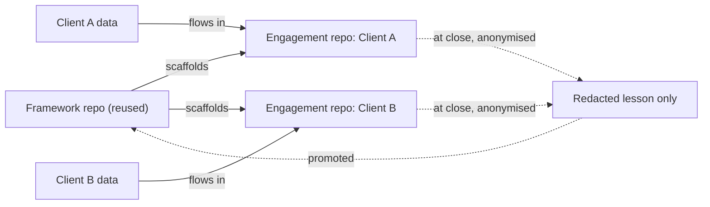
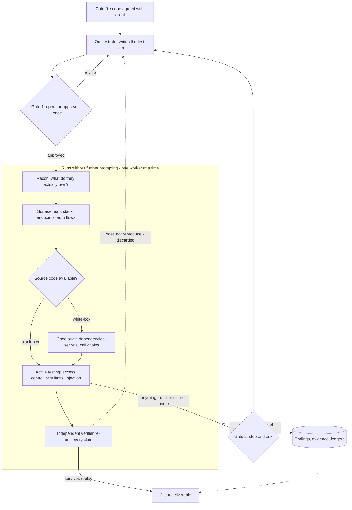
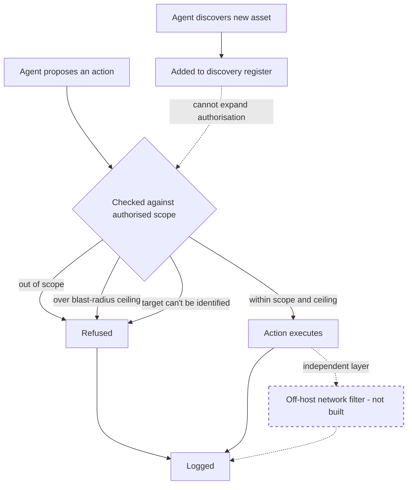

# Pitch diagrams

Three diagrams for the demo. Each is standalone: title, a spoken-length caption, the diagram, then
an "if they ask" note.

**Convention used throughout:** anything drawn with a **dashed border** and the words **"not
built"** in its own label is specced only — nothing running today enforces it. A dashed border
alone is never the only signal, because the room may see this in greyscale or a dark theme; the
text marker carries the meaning. Everything else on these diagrams reflects what the design
commits to now, not a future promise.

---

## Diagram 1 — Repo separation

**One client's data cannot structurally leak into another client's engagement.**

Say aloud: "Two kinds of repository, permanently separate. The framework gets reused on every job.
Each client gets their own throwaway repo that their data flows into — and only into. The only
thing that ever comes back out is a redacted lesson, deliberately promoted when the engagement
closes. Nothing else crosses the line."

**If they ask:**
- *"Could a client's data end up in the framework by accident?"* — Only via a manual, out-of-band
  copy someone chose to make; the repos being separate means that's an unusual deliberate act, not
  a default outcome of doing the work.
- *"What actually moves between engagements?"* — Only a redacted lesson, deliberately promoted at
  close, never raw findings, credentials, or captures.
- *"Do you reuse anything else per client?"* — Yes: the framework, its playbooks, and its scripts —
  never a client's data.

---

## Diagram 2 — Engagement flow

**A repeatable production line, not a person improvising.**

Say aloud: "We agree the scope once. Then the orchestrator writes a test plan — which systems get
touched, how hard, what classes of test — and I approve that plan a single time.

What happens after that approval is the part worth watching, because it's where the man-hours go.
It maps the public footprint and works out what they actually own, which founders routinely don't
know. It fingerprints the stack and pulls apart the app's own delivered code to recover the real
internal map — the exact table and endpoint names, not guesses. If we have source access, it goes
through dependencies, secrets and call chains as well. Then it tests: access-control boundaries,
rate limits, injection, the things a founder assumes someone checked.

Every claim it makes then gets handed to a separate verifier that re-runs it from scratch and
throws out anything that doesn't reproduce. Only what survives that reaches the report.

Each stage writes to disk and the next stage reads from disk — not from a chat history that gets
summarised away. One worker runs at a time, deliberately, because parallel agents claiming findings
against the same system is how you get an audit that can't be trusted. And if anything strays
outside what I approved, it stops and asks rather than improvising."

**If they ask:**
- *"Does the operator watch every action?"* — No, and that's the design. Approval happens once, at
  the plan gate, because operator judgement is worth most deciding what will be done and worth
  least rubber-stamping the ninety-third in-plan request. Anything outside the approved plan stops
  and asks.
- *"Why does a separate agent verify?"* — Because the one that formed a belief is the worst
  skeptic of it. The verifier carries no memory of the reasoning that produced the claim; it just
  re-runs it. Anything that doesn't reproduce gets demoted rather than shipped.
- *"Why only one worker at a time?"* — Parallel agents all claiming findings against one live
  system is how you get double-counted evidence, unattributable requests, and a rate-limit overrun
  nobody meant to cause. Recon could safely fan out later; anything that touches state or claims a
  finding stays serialised.
- *"Why files instead of chat history?"* — Conversation gets summarised away between sessions. The
  files are what the next stage actually reads, and they're also the audit trail.
- *"Is this running end-to-end today?"* — The gate model and the scope enforcement are built and
  tested. The stages themselves are being built in order; the scaffolder and the first playbooks
  are next.

---

## Diagram 3 — Enforcement layer

**Authorisation is a code path, not a promise.**

Say aloud: "Before any action runs, it's checked against what was actually authorised — and
refused if it's out of scope, too aggressive for the agreed ceiling, or if the target can't even
be pinned down. If the agent finds something new, that gets written to a record of what's out
there — but discovering something never quietly widens what the agent is allowed to touch. That
still takes a person saying yes."

**If they ask:**
- *"Can this be tricked or bypassed?"* — Yes, in principle — it's a heuristic layer that catches
  sloppy scope drift, not an impassable wall; a determined attempt at obfuscation can still slip
  past a command parser, which is exactly why it fails closed on anything it can't read.
- *"So what actually stops it if the check itself is fooled?"* — Honestly, not the network yet —
  the off-host filter that would block traffic regardless of what the check decided is designed
  but not built, so today's true claim is "refused and logged," not "cannot happen."
- *"What happens when it finds something new mid-job?"* — It's logged as a candidate asset; testing
  it requires the operator to explicitly bring it into scope. Discovery never self-authorises.
